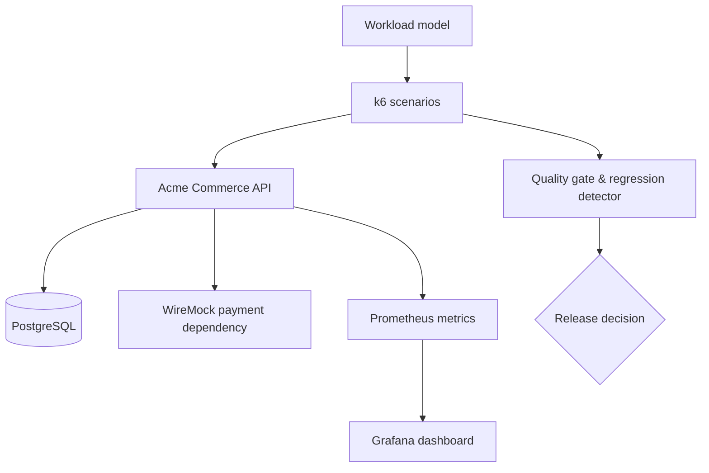

# Performance & Reliability Testing Framework

[](https://github.com/ashokmanohar-ai/performance-reliability-testing/actions/workflows/performance-smoke.yml)
[](https://nodejs.org/)
[](https://grafana.com/docs/k6/)
[](LICENSE)

A production-style performance engineering reference implementation using k6, TypeScript, Docker,
Prometheus, and Grafana to validate latency, throughput, scalability, resilience, reliability, and
release readiness.

This is an engineering framework, not a collection of load scripts. It turns an evidence-based
workload model into repeatable tests, correlates client and service telemetry, compares equivalent
runs, and exits non-zero when measurable release criteria fail.

## Recruiter quick tour

> **60-second decision:** this repository demonstrates performance engineering as a release-control system—not a folder of load scripts.

| Recruiter signal | Evidence in this repository |
| --- | --- |
| Workload breadth | Smoke, baseline, load, stress, spike, soak, scalability, capacity, and resilience scenarios |
| Production thinking | Explicit SLOs, percentile analysis, safe workload controls, regression detection, and release decisions |
| System depth | k6 + TypeScript, inspectable API target, PostgreSQL, WireMock fault injection, Prometheus, Grafana, Docker, and CI |
| Interview path | [Architecture](docs/architecture.md) → [results analysis](docs/results-analysis.md) → [2- and 5-minute walkthrough](docs/interview-walkthrough.md) |

**Five-minute proof:** start the documented Docker environment, run `npm run perf:smoke`, and inspect the k6 summary plus the evidence-based quality-gate decision.

## Business problem

A functional `200 OK` does not prove that a service will meet customer expectations at peak traffic,
remain stable for hours, or recover when a dependency slows down. Teams need a controlled way to
answer five release questions:

1. Does the system meet its latency, error-rate, throughput, and business-success objectives?
2. At what load does it begin to degrade, and what resource becomes constrained?
3. Does it recover after spikes and downstream failures?
4. Did this build regress relative to a comparable measured baseline?
5. Is the evidence strong enough to approve a release?

## Performance engineering, not only performance testing

Performance testing generates load and measures behaviour. Performance engineering also establishes
the workload model, service objectives, production-like data, observability, bottleneck analysis,
capacity hypotheses, regression policy, safety controls, and release decision. This repository covers
that wider lifecycle.

## Key capabilities

- k6 smoke, baseline, load, stress, spike, soak, scalability, capacity, and reliability scenarios
- Realistic weighted commerce journeys with per-VU users, variable think time, and correlation IDs
- Fastify/TypeScript Acme Commerce API backed by PostgreSQL
- Controlled WireMock payment failures: 500, 503, delay, intermittent failure, and restoration
- Bounded exponential retries, timeouts, transactional inventory, and idempotent payment processing
- Standard and business metrics: p50/p90/p95/p99, throughput, errors, checkout and recovery
- Prometheus application/process/DB-pool metrics and a pre-provisioned Grafana dashboard
- Absolute SLO gates plus environment-matched historical regression detection
- PR, nightly, and release GitHub Actions with evidence artifacts and non-zero failure exits
- Explicit remote-target, maximum-VU, and maximum-duration protection

## Architecture



See [Architecture](docs/architecture.md) for component boundaries and the metrics/release pipeline.

## Technology stack

| Layer                 | Technology                      | Purpose                                                        |
| --------------------- | ------------------------------- | -------------------------------------------------------------- |
| Load generation       | k6                              | Scenario execution, thresholds, custom metrics, JSON summaries |
| Demo target           | Node.js 22, TypeScript, Fastify | Stable, inspectable API target                                 |
| Data                  | PostgreSQL 16                   | Transactions, inventory, connection-pool behaviour             |
| Dependency simulation | WireMock                        | Deterministic downstream delay and failure                     |
| Metrics               | Prometheus                      | Scrape and retain application/process metrics                  |
| Visualisation         | Grafana                         | Request, latency, error, CPU, memory, and DB panels            |
| Quality gates         | Node.js                         | SLO evaluation, regression comparison, report generation       |
| Delivery              | Docker Compose, GitHub Actions  | Reproducible environment and automated release evidence        |

OpenTelemetry is documented as an optional extension; it is not a blocking runtime dependency.

## Repository map

```text
demo-app/                    Fastify API, database schema, metrics, and unit tests
framework/                   Reusable k6 clients, config, data, metrics, and journeys
tests/performance/           Smoke through capacity and resilience scenarios
reliability/                 WireMock mapping and controlled fault injector
observability/               Prometheus and provisioned Grafana assets
quality/                     Policy, parser, regression detector, gate, report
scripts/                     Health polling, data lifecycle, config validation
docs/                        Strategy, architecture, operations, interview guide
.github/workflows/           PR, nightly, and release quality gates
results/                     Generated evidence and labelled demo baseline
```

## Workload model

The default business mix is an explicit, configurable hypothesis:

| Journey         | Share |
| --------------- | ----: |
| Browse products |   45% |
| Search products |   20% |
| View product    |   15% |
| Create cart     |   10% |
| Checkout        |    7% |
| View orders     |    3% |

Replace this mix with production analytics or agreed forecasts for real projects. VU counts alone do
not model traffic; arrival rate, journey frequency, think time, session reuse, peak shape, data volume,
and geography also matter. See [Workload modelling](docs/workload-modelling.md).

## Test catalogue

| Type        | Purpose                                                         | Portfolio default     |
| ----------- | --------------------------------------------------------------- | --------------------- |
| Smoke       | Detect catastrophic latency/error changes on each PR            | 5 VUs, 30s            |
| Baseline    | Establish a controlled reference under normal conditions        | 10 VUs, 2m            |
| Load        | Validate a representative sustained business mix                | ramp to 50 VUs        |
| Stress      | Locate degradation and approximate breaking behaviour           | 50 → 400 VUs          |
| Spike       | Test a sudden surge and recovery                                | 10 → 200 → 10 VUs     |
| Soak        | Detect progressive latency, leaks, and exhaustion               | 25 VUs, 15m           |
| Scalability | Compare throughput/latency at load steps                        | 50 → 100 → 200 VUs    |
| Capacity    | Increase arrival rate until an objective fails                  | 10 → 300 iterations/s |
| Reliability | Validate timeout, retry, recovery, partial failure, idempotency | controlled local stub |

Defaults are safe portfolio values, not claimed enterprise capacity. `CI_SAFE=true` reduces staged
profiles for shared GitHub runners. Enterprise-scale generation belongs on dedicated runners,
Grafana Cloud k6, or k6 Operator.

## Prerequisites

- Node.js 22 and npm
- Docker Engine with Docker Compose v2
- k6 on `PATH`
- At least 4 GB free memory for the complete local stack

## Install

```bash
git clone https://github.com/ashokmanohar-ai/performance-reliability-testing.git
cd performance-reliability-testing
cp .env.example .env
```

Replace every `change-me`/`replace-with` value in `.env`, then:

```bash
npm ci
npm run validate
```

On Windows Command Prompt use `copy .env.example .env`; on PowerShell use
`Copy-Item .env.example .env`.

## Start the Docker environment

```bash
docker compose up -d --build
node scripts/wait-for-health.js
npm run data:seed
docker compose ps
```

The health utility polls readiness rather than relying on a fixed startup sleep.

| Service        | URL                              |
| -------------- | -------------------------------- |
| API health     | <http://localhost:3000/health>   |
| API metrics    | <http://localhost:3000/metrics>  |
| WireMock admin | <http://localhost:8080/__admin/> |
| Prometheus     | <http://localhost:9090>          |
| Grafana        | <http://localhost:3001>          |

Use the Grafana credentials from `.env`. The provisioned dashboard appears under **Performance
Engineering**.

## Run performance tests

```bash
npm run perf:smoke
npm run perf:baseline
npm run perf:load
npm run perf:stress
npm run perf:spike
npm run perf:soak
npm run perf:scalability
npm run perf:capacity
npm run perf:resilience
```

Run a specific scenario directly:

```bash
TEST_ENV=LOCAL RESULT_FILE=results/current/order-load.json \
  k6 run tests/performance/load/order-load.js
```

For Windows PowerShell:

```powershell
$env:TEST_ENV='LOCAL'
$env:RESULT_FILE='results/current/order-load.json'
k6 run tests/performance/load/order-load.js
```

## Environment selection

Supported names are `LOCAL`, `DEV`, `QA`, and `UAT`.

```bash
TEST_ENV=QA BASE_URL=https://authorised-qa.example.test \
ALLOW_REMOTE_LOAD_TEST=true PERF_PROFILE=NORMAL_LOAD \
k6 run tests/performance/load/commerce-load.js
```

Remote load is deliberately blocked unless explicitly authorised. Smoke and baseline still require a
valid target and credentials. Never use this repository against production or a third party without
scope, capacity, monitoring, rollback, and written approval.

## Test data and authentication

`npm run data:seed` creates 100 products and 500 deterministic test users. Each VU selects a distinct
user where possible; read-only catalogue data is shared. User-journey tests log in once per VU and
reuse the token. The smoke suite separately exercises authentication load so token issuance can be
measured without distorting every business request.

```bash
npm run data:reset  # removes carts, orders, and payments; retains catalogue/users
npm run data:seed
```

## Metrics and percentiles

k6 captures `http_reqs`, `http_req_duration`, `http_req_failed`, checks, iterations, VUs, and network
volume. Custom metrics include:

- `login_duration`, `checkout_duration`, and `order_creation_duration` (`Trend`)
- `checkout_success_rate` and `payment_failure_rate` (`Rate`)
- `business_transactions` and `duplicate_transactions` (`Counter`)
- `active_business_journey` (`Gauge`)
- `recovery_time_ms` (`Trend`)

The gate uses p95 as its primary latency objective and also retains p50, p90, and p99. Averages can
hide the experience of slow cohorts; p99 is especially useful for tail-latency and retry effects.

## SLO policy and thresholds

Central policy lives in [`quality/performance-policy.json`](quality/performance-policy.json); k6
runtime thresholds live in [`framework/config/thresholds.js`](framework/config/thresholds.js).

Default API criteria are p95 ≤ 750 ms, p99 ≤ 1500 ms, errors ≤ 1%, and checks ≥ 99%. Checkout has a
separate 1200 ms p95 and 99% success objective. Change these only with a documented service or
business requirement.

## Quality gate and regression detection

```bash
RESULT_FILE=results/current/summary.json npm run perf:gate
RESULT_FILE=results/current/summary.json npm run perf:report
npm run perf:regression -- results/current/summary.json results/baseline/equivalent.json
```

The gate evaluates absolute objectives and exits non-zero on failure. The regression detector checks:

- p95 increase ≤ 10%
- error-rate increase ≤ 0.5 percentage points
- throughput ratio ≥ 0.9

Only compare runs with equivalent code, workload, data, environment, and load-generator topology.
`results/history/demo-baseline.json` is deliberately marked `DEMO_SAMPLE`; it demonstrates the schema
and is not execution evidence.

## Reliability and resilience

The payment dependency is controlled locally through one stable WireMock mapping. Scenarios verify:

- 500/503 responses become bounded, controlled API failures
- retry count and exponential backoff remain finite
- a 5-second dependency delay is terminated by the application timeout
- service success returns after dependency restoration and recovery is measured
- five concurrent requests with one idempotency key create one payment record
- transactional inventory updates prevent partial order commits

Run individual cases from `tests/performance/resilience/`. Each scenario restores the success mapping
in teardown.

## Observability and bottleneck analysis

The app emits request rate/duration/errors, process CPU/memory, selected DB query latency, and DB pool
state. Incoming `x-correlation-id` becomes the Fastify request ID, is returned to the caller, and is
included in structured error logs. Use the same ID to move from a slow k6 transaction to the relevant
service log. See [Observability](docs/observability.md).

Set `SIMULATE_PRODUCT_DELAY_MS=500` for a controlled degraded comparison. It is disabled by default.
If p95 rises while CPU and memory remain stable but DB query p95 rises, investigate the query plan,
index selectivity, locks, data volume, and pool wait—not only application code.

## CI/CD strategy

- **Pull request:** 30-second performance smoke, absolute gate, artifact upload
- **Nightly:** CI-safe load, absolute gate, comparison with the prior equivalent cached run
- **Release:** manually selected load/stress profile, recovery/idempotency, report, final gate

Heavy workloads must use dedicated infrastructure. The repository also documents equivalent Jenkins
and Azure DevOps stages in [CI/CD](docs/ci-cd.md).

## Distributed testing

For large tests, use k6 Operator on Kubernetes or Grafana Cloud k6. Distribute one defined workload
across workers, aggregate the same tagged metrics, place generators in representative regions, and
monitor generator saturation. Do not multiply per-worker arrival rates accidentally. The local
repository remains single-generator by design.

## Safety controls

- Local API is the default target.
- `ALLOW_REMOTE_LOAD_TEST=false` blocks remote load/stress/spike/soak/capacity/scalability profiles.
- `MAX_VUS` and `MAX_DURATION` reject runaway configuration during k6 initialisation.
- CI reduces heavy stages with `CI_SAFE=true`.
- No real credentials or endpoints are committed.
- Long-running and destructive tests require explicit environment ownership.

## Design decisions

- **Small real target over a mock-only demo:** exposes genuine DB, transaction, pool, retry, and
  resource behaviour while remaining understandable in an interview.
- **Policy separate from scripts:** release criteria can be governed without editing every scenario.
- **Measured historical comparison:** avoids fake results and warns against unlike-environment data.
- **Prometheus metrics plus k6 summaries:** server/resource context complements black-box client data.
- **Optional traces:** metrics/logs remain runnable even when an OTLP collector is absent.

## Troubleshooting

Use [Troubleshooting](docs/troubleshooting.md) for unhealthy containers, failed seed, k6 connectivity,
remote safety blocks, missing output directories, Grafana provisioning, and threshold failures.

## Limitations

- This portfolio stack runs one application instance and one PostgreSQL node; it does not claim
  production-scale capacity.
- The local dashboard scrapes application metrics, not host/container cAdvisor metrics.
- OpenTelemetry and distributed k6 are documented extensions, not required local services.
- GitHub-hosted runners are intentionally restricted to short, safe workloads.
- Baselines are only valid within their measured context; the bundled demo file is illustrative.

## Roadmap

- Add a container metrics exporter for host-level saturation analysis
- Add k6 Operator examples for an opt-in Kubernetes environment
- Persist benchmark history in a time-series backend with build annotations
- Add optional OTLP traces and exemplars without changing the default runnable path

## Interview walkthrough

The two-minute and five-minute narratives, design trade-offs, and common performance-engineering
questions are in [Interview walkthrough](docs/interview-walkthrough.md).

## Contributing and security

Read [CONTRIBUTING.md](CONTRIBUTING.md) before changing workload models or thresholds. Report security
issues according to [SECURITY.md](SECURITY.md).

## License

MIT — see [LICENSE](LICENSE).
