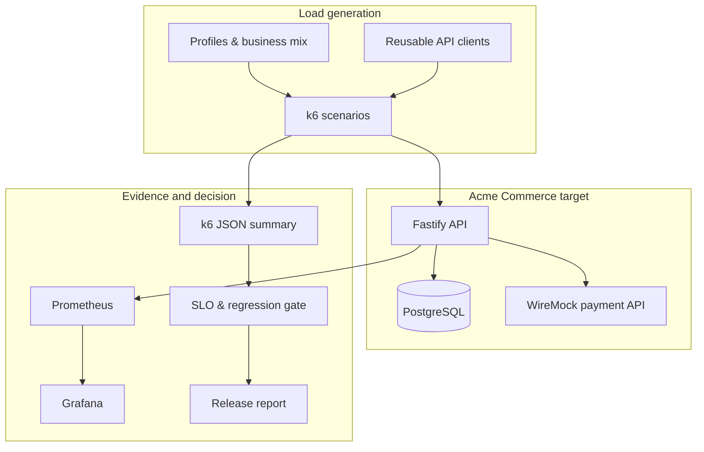
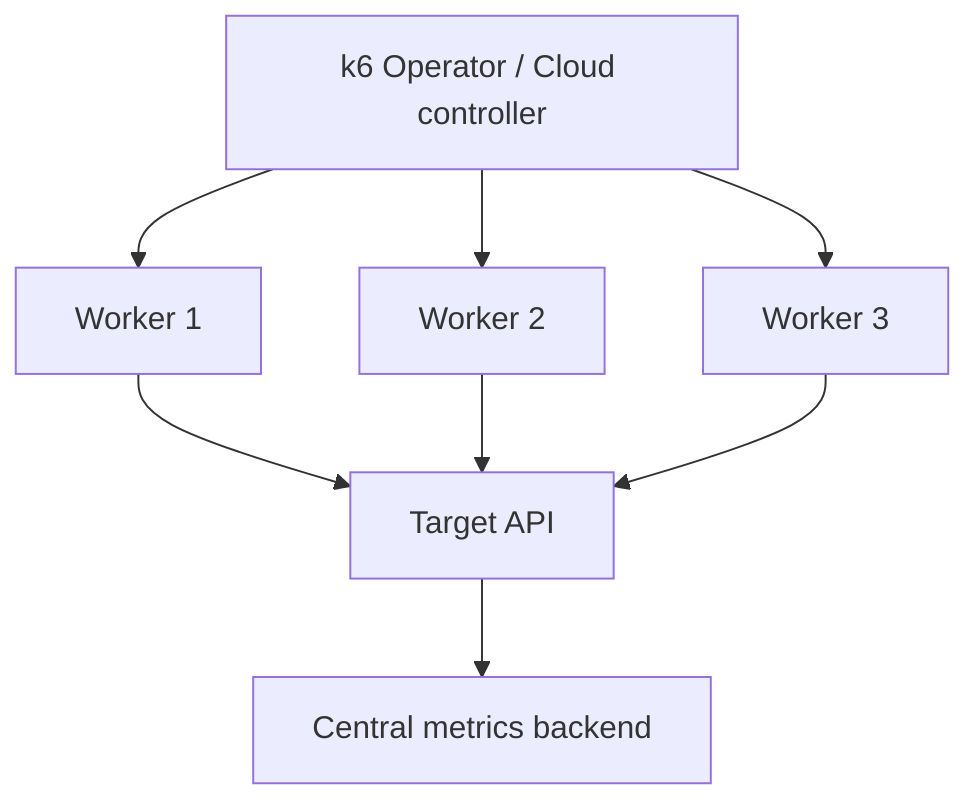

# Architecture

## Component view

The framework separates workload intent, protocol clients, business journeys, execution profiles, and
release policy. This avoids copying authentication, headers, metrics, and thresholds into every test.

## Request and evidence flow

1. Environment configuration resolves a target and the safety guard evaluates profile VUs/duration.
2. Each k6 VU authenticates once, sends an `x-correlation-id`, and follows a weighted journey.
3. Fastify uses that correlation ID as its request ID and executes real PostgreSQL transactions.
4. k6 records black-box latency, throughput, errors, checks, and business transaction metrics.
5. Prometheus scrapes server-side request/process/DB-pool/query metrics for diagnosis.
6. A JSON summary is parsed without inventing missing values.
7. The gate evaluates absolute SLOs and, when comparable evidence exists, regression tolerances.
8. CI fails on a negative decision and retains summaries/reports as artifacts.

## Reliability boundary

The payment adapter implements timeout, retry, and bounded exponential backoff. A unique database
constraint claims each idempotency key before the downstream call, preventing concurrent duplicate
charges. WireMock changes are scoped to one known mapping ID and restored during teardown.

## Distributed extension

When scaling out, define whether arrival rate is global or per worker, place generators close to the
intended user regions, synchronise test data, and prove that generators are not CPU/network bound.

## Deliberate boundaries

The app is intentionally small: it is a stable measurement target, not a commerce product. Optional
OpenTelemetry and Kubernetes deployment are excluded from the blocking local path to preserve
reproducibility. Container/host exporters can be added when infrastructure saturation evidence is
needed.
