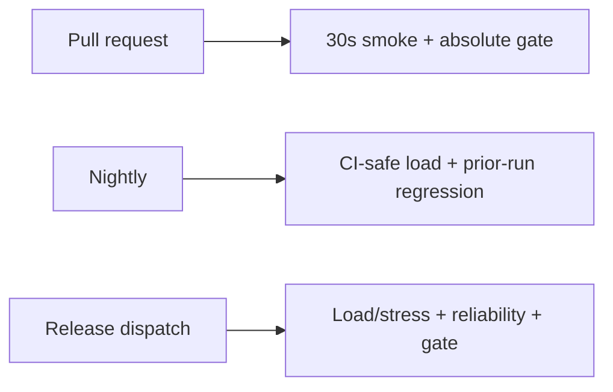

# CI/CD Integration

## GitHub Actions

All workflows upload raw JSON and generated reports. They print Docker diagnostics on failure and tear
down volumes on every outcome. GitHub-hosted loads are intentionally small; dedicated runners are
required for meaningful enterprise capacity tests.

## Jenkins

Create stages for checkout, Node/k6 prerequisites, `npm ci`, `npm run validate`, Compose build/up,
health polling, seed, selected k6 profile, gate/report, and artifact archive. Use `post { always { ... }
}` for Compose teardown. Keep credentials in Jenkins Credentials, inject them as masked environment
variables, and reserve labelled performance agents to reduce noisy-neighbour variance.

## Azure DevOps

Use a dedicated self-hosted agent pool. Map the same stages to `Npm@1` or scripts, Docker Compose,
health/seed, k6, gate, and `PublishPipelineArtifact@1`. Store secrets in a variable group backed by
Key Vault; mark them secret. Use scheduled pipelines for load and manual approvals/checks for the
release environment.

## Gate governance

Protect the main branch with the performance-smoke check. Restrict policy edits through CODEOWNERS in
an enterprise fork. A workflow YAML parse is not execution validation; confirm the first real run,
service health, artifact content, and deliberate controlled-failure behaviour before making the check
mandatory.
